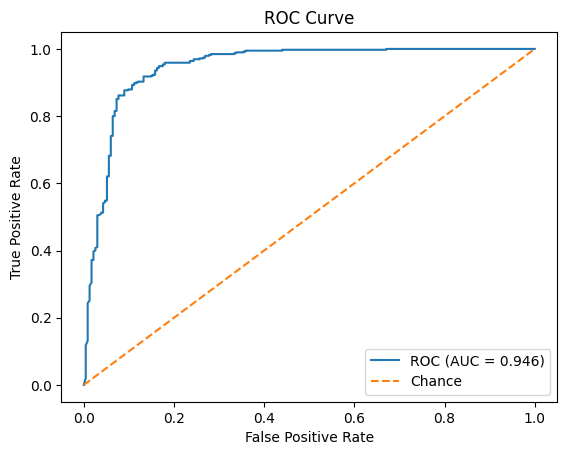
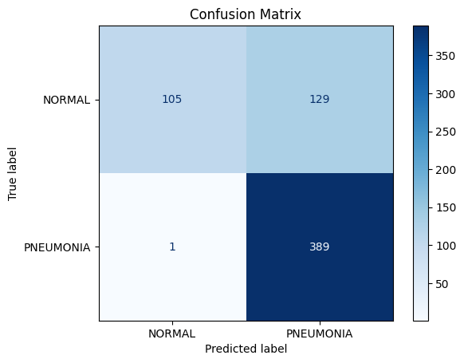
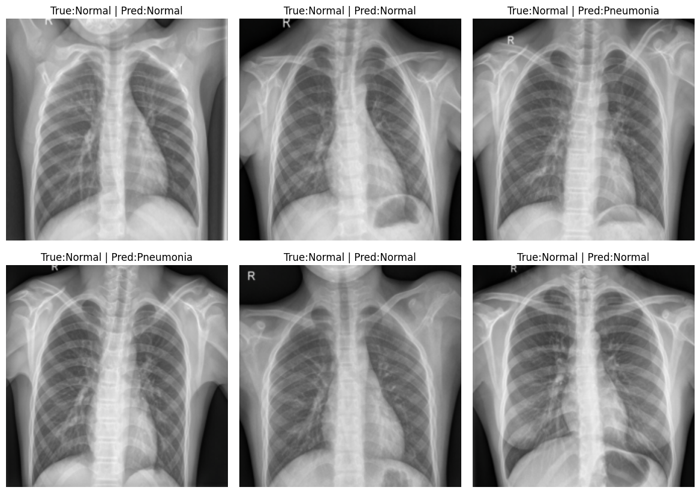
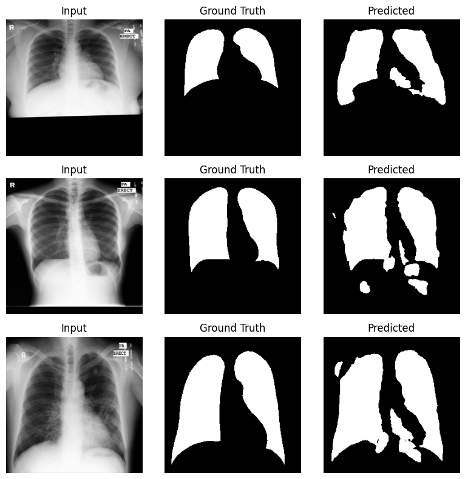

# Chest X-ray Intelligence

### Pneumonia Classification with ResNet-18 · Lung Segmentation with U-Net

[](https://www.python.org/)
[](https://pytorch.org/)
[](#)

An end-to-end medical imaging portfolio project that combines two complementary deep-learning tasks:

- **Classification** — identify chest X-rays as `NORMAL` or `PNEUMONIA` with transfer learning.
- **Segmentation** — isolate lung regions at pixel level for downstream image analysis.

The original experiments were developed in Jupyter notebooks and then refactored into reusable, testable PyTorch modules with command-line training and inference workflows.

## Results at a Glance

| Task | Architecture | Evaluation result |
|---|---|---|
| Pneumonia classification | Pretrained ResNet-18 | **ROC-AUC 0.9462** · F1 0.8568 · Accuracy 79.17% |
| Lung segmentation | U-Net | **Best validation IoU 0.887** |

*Metrics are reproduced from the saved outputs of the original notebook experiments.*

## Classification Results

The classifier was fine-tuned from ImageNet weights and evaluated on 624 test X-rays. Its ROC-AUC of **0.9462** shows strong ranking performance across the two classes.

<p align="center">
  
  
</p>

### Representative Predictions

The following predictions come directly from the notebook test run. Both correct predictions and false-positive cases are shown to make model behavior visible.



## Segmentation Results

The U-Net learns a binary lung mask from grayscale chest X-rays. Validation examples below show the input image, annotated ground truth, and model prediction side by side.



The recorded 10-epoch experiment reached its best validation IoU of **0.887** at epoch 7. The refactored data loader also recognizes both `image.png` and `image_mask.png` naming conventions, making all **704 available image–mask pairs** discoverable.

## System Design

### Classification Pipeline

```text
Chest X-ray
    → grayscale-to-RGB conversion
    → augmentation + ImageNet normalization
    → pretrained ResNet-18
    → class-weighted cross-entropy
    → Normal / Pneumonia probability
```

### Segmentation Pipeline

```text
Chest X-ray + lung mask
    → paired geometric augmentation
    → U-Net encoder–decoder with skip connections
    → BCE + Dice loss
    → probability map
    → binary lung mask + optional overlay
```

## Engineering Highlights

- Shared preprocessing between classification training and inference.
- Class-weighted loss for the imbalanced pneumonia dataset.
- Mask-safe nearest-neighbor interpolation during segmentation augmentation.
- AdamW, learning-rate scheduling, early stopping, and CUDA mixed precision.
- Reproducible dataset splitting and automatic CUDA / Apple MPS / CPU selection.
- Atomic checkpoints containing class mapping and preprocessing metadata.
- Backward-compatible loading of the original ResNet and U-Net checkpoints.
- Automated tests for model shapes, metrics, dataset splitting, and train/eval loops.

## Repository Structure

```text
.
├── assets/            # Portfolio result figures
├── classification/    # ResNet-18 data, model, training, evaluation, inference
├── segmentation/      # U-Net data, model, loss, metrics, training, inference
├── tests/             # Unit and smoke tests
├── common.py          # Device, seed, and checkpoint utilities
└── requirements.txt
```

## Quick Start

### 1. Install

```bash
python -m venv .venv
source .venv/bin/activate
python -m pip install -r requirements.txt
```

### 2. Train the classifier

The classification dataset follows the standard `ImageFolder` layout with `train`, `val`, and `test` splits, each containing `NORMAL` and `PNEUMONIA` directories.

```bash
python -m classification.train \
  --data-dir /path/to/chest_xray \
  --output checkpoints/classification_best.pth
```

### 3. Run classification inference

```bash
python -m classification.predict /path/to/xray.jpeg \
  --checkpoint checkpoints/classification_best.pth
```

### 4. Train the segmenter

```bash
python -m segmentation.train \
  --images /path/to/CXR_png \
  --masks /path/to/masks \
  --output checkpoints/segmentation_best.pth
```

### 5. Generate a mask and overlay

```bash
python -m segmentation.predict /path/to/xray.png \
  --checkpoint checkpoints/segmentation_best.pth \
  --output outputs/lung_mask.png \
  --overlay outputs/lung_overlay.png
```

## Datasets

- [Chest X-Ray Images (Pneumonia)](https://www.kaggle.com/datasets/paultimothymooney/chest-xray-pneumonia) — 5,856 pediatric chest X-rays organized into Normal and Pneumonia classes.
- [Chest Xray Masks and Labels](https://www.kaggle.com/datasets/nikhilpandey360/chest-xray-masks-and-labels) — 800 chest X-rays with 704 available lung masks.

All images shown in this repository come from these public Kaggle datasets and are de-identified.

## Validation

```bash
python -m compileall classification segmentation common.py
pytest -q
mypy --ignore-missing-imports common.py classification segmentation
```

> This project is intended for research and portfolio demonstration, not clinical diagnosis.
